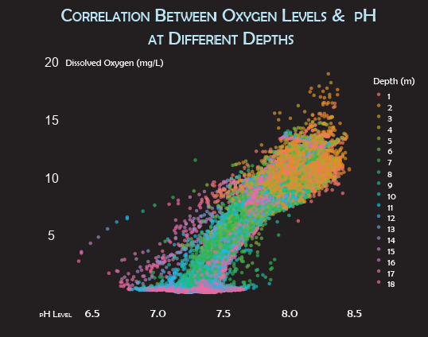
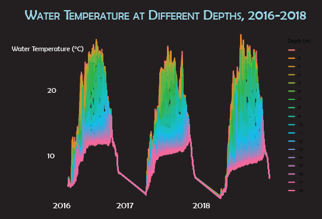

# Viz-a-Thon-Onondaga-Water-Analysis: What Lies Beneath  
**Exploring Patterns in Onondaga Lake Water Chemistry**

This mini-project was completed during a timed data visualization hackathon. We analyzed long-term lake water quality data from Onondaga County, focusing on pH, dissolved oxygen, and temperature across 18 depths.

---

## 📊 Visuals

### Dissolved Oxygen vs. pH at Different Depths  

### Water Temperature Across Depths (2016–2018)  

These plots reveal:
- Seasonal thermal layering and mixing zones
- Clear vertical patterns in oxygen + pH distribution
- Implications for aquatic health and ecological monitoring

---

## 🛠 Tools Used
- R, `ggplot2`, `dplyr`, `tidyr`  
- Adobe Illustrator (poster layout)

## 👩‍💻 Role
Led data prep, exploratory analysis, and final poster design. Selected color schemes and visual encodings to emphasize depth variation.

## 🎯 Outcome
Final visualization submitted as part of the Syracuse Viz-a-Thon 2024.  
Theme: *“Surface to Seafloor — What Lies Beneath”*

